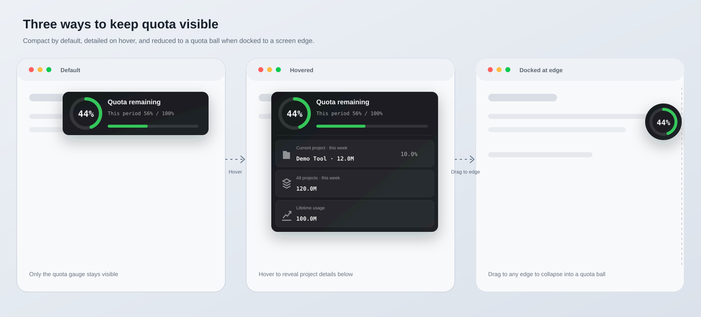

# Codex Token Monitor

[English](README.md) | [简体中文](README.zh-CN.md)

> A floating Codex quota gauge for macOS and Windows; hover for local Token usage.



`Default: 60% remaining ring | 40% used / 100% | progress bar`<br>
`Hover downward: Current project / All projects / Lifetime usage`

The macOS edition requires macOS 13 or later. Universal 2 builds support Apple silicon and Intel Macs. The Windows portable edition requires Windows 10/11 with built-in Windows PowerShell 5.1. Both require Codex installed and signed in.

### Windows

Download the Windows ZIP from the [v1.3.1 preview](https://github.com/ArloYi/Codex-Token-Monitor/releases/tag/v1.3.1), extract **all files**, open Codex and double-click `Start.cmd`. From a source checkout, run `Windows/Start.cmd`. No extra runtime installation is required. Hover to expand, drag to move or dock as a circle, and right-click to exit. See [Windows instructions](Windows/README.md).

Windows shows the **most recently active local project**, not the currently selected task. Its Token totals use local session rollouts; macOS uses the desktop task title and database. Windows UI is currently English. Windows desktop behavior is pending a real Windows smoke test.

## What it shows

- A circular remaining-quota gauge, used percentage, and progress bar are always visible.
- Tokens used by the selected project during the current week.
- Total Tokens used by all local projects during the current week.
- The selected project's share of weekly Token usage.
- Lifetime Token usage when Codex provides it, with a local fallback.
- Project name and usage update within five seconds after you switch tasks or projects in Codex. On first launch, macOS may ask for Accessibility permission so the monitor can read the current task title shown in the Codex header.
- Hover anywhere over the HUD to reveal details; move away to collapse.
- The quota gauge stays in place while the detail rows expand downward.
- The default size is 82% of the reference design. Drag the bottom-right grip while expanded to resize the whole HUD proportionally from 65% to 125%.
- Drag the HUD to any screen edge to collapse it into a circular quota ball. Drag the ball back into the screen to restore the full card.
- A truly transparent rounded window and semantic colors stay clean in light and dark appearances.

The HUD appears only while Codex is the frontmost app. Its main surface passes clicks through to Codex, and it does not use the menu bar or activate itself.

## Download

Download the Universal 2 ZIP and checksum from the [v1.3.1 preview](https://github.com/ArloYi/Codex-Token-Monitor/releases/tag/v1.3.1) for current Codex compatibility and the data-refresh fix. The [latest stable release](https://github.com/ArloYi/Codex-Token-Monitor/releases/latest) remains v1.2.2. Extract the archive, move the app to Applications if desired, quit any running older monitor, and open the new app.

The app uses a local ad-hoc signature and is not notarized by Apple. On first launch, macOS may ask you to confirm the app under System Settings > Privacy & Security.

## Build from source

```bash
git clone https://github.com/ArloYi/Codex-Token-Monitor.git
cd Codex-Token-Monitor
zsh ./scripts/test.sh
open "build/Codex Quota HUD.app"
```

Requirements:

- macOS 13 or later
- Xcode Command Line Tools
- Codex desktop app
- Homebrew and `ripgrep` for the test suite
- The system `sqlite3`, `codesign`, and `zip` tools

Executable discovery supports the current Codex/ChatGPT app bundles and `PATH`. Set `CODEX_BINARY` to an executable path if needed; `CODEX_HOME` overrides the default `.codex` directory. The app-server uses its default stdio transport and handles both legacy and multi-bucket quota responses.

On macOS, quota polling runs independently once per minute, while local project statistics refresh every five seconds. History files are streamed and their pre-window Token baselines are cached in memory; unfinished scans resume after appends, while replacement or truncation resets them. For troubleshooting, `CODEX_MONITOR_DEBUG=1` prints refresh success and timing to stderr without project names or Token values.

Install the test dependency with:

```bash
brew install ripgrep
```

To create a distributable ZIP:

```bash
zsh ./scripts/package-release.sh
```

The Universal 2 archive and its SHA-256 checksum are written to `dist/`. Build artifacts and release archives are excluded from Git.

## Use

```text
Default: [ drag | remaining ring | used ratio | progress ]
Hover:   [ drag | quota gauge ]
         [ current project ]
         [ all projects ]
         [ lifetime usage | resize grip ]
Edge:   ( quota % ball )
```

1. Open Codex.
2. Launch `Codex Quota HUD.app`.
3. If macOS requests Accessibility permission, allow it for **Codex 额度**. The permission is used only to read the current task title shown in the Codex header.
4. Select a project in Codex and wait up to five seconds.
5. Hover over the HUD to reveal the project name, weekly usage, weekly total, share, and lifetime total.
6. Drag the HUD to a screen edge and release to collapse it into a status ball. Drag the ball away from the edge to restore it.
7. Switch to another app, such as Chrome, Slack, or WeChat. The HUD hides immediately.

## Data definitions

| Metric | Meaning | Source |
|---|---|---|
| Quota remaining | Remaining percentage in the current quota window | Local Codex `app-server` |
| Project weekly usage | Tokens used by the selected project during the quota window | Local Codex state and SQLite data |
| Weekly total | Tokens used by all local projects during the quota window | Local Codex SQLite and rollout data |
| Project share | Project weekly usage divided by weekly total | Calculated locally |
| Lifetime usage | Account lifetime total, with cached or local fallback | Local Codex `app-server` and local state |

The app prefers the quota window returned by Codex. If it is unavailable, it uses the most recent seven days. With Accessibility permission, project selection reads only the visible current-task title from the Codex header, matches it to local Codex task metadata, and maps its working directory to the containing project. If that signal or permission is unavailable, it falls back to the most recently active local task, then to `selected-project` and `active-workspace-roots`.

## Privacy

Codex Token Monitor reads only the local Codex data required to calculate and display usage:

- `~/.codex/.codex-global-state.json`
- `~/.codex/state_5.sqlite`
- `~/.codex/session_index.jsonl`
- rollout files referenced by the local Codex database
- quota and lifetime usage returned by the local Codex `app-server`
- the visible current-task title in the Codex window, when Accessibility permission is granted

The monitor contains no networking client and does not upload project paths, Codex state, rollout content, or usage statistics. It starts the Codex-provided `app-server` locally and communicates with it over standard input and output. Any communication performed by Codex itself remains subject to the terms and privacy practices that apply to Codex and OpenAI.

The app stores only the HUD position, scale, edge-docking state, and the last available lifetime Token value in macOS user defaults. It does not install a login item, launch agent, notification service, analytics SDK, or crash-reporting SDK.

See [Privacy](PRIVACY.md), [Security](SECURITY.md), and the [disclaimer](DISCLAIMER.md) for the complete data boundary, reporting guidance, and terms of use.

## Project structure

```text
.
├── App/                    # macOS app metadata
├── Sources/                # Native Objective-C implementation
├── docs/                   # PRD and interface assets
├── scripts/                # Build, test, privacy scan, and packaging
├── .github/                # CI, issue templates, and PR template
├── CONTRIBUTING.md
├── DISCLAIMER.md
├── PRIVACY.md
├── SECURITY.md
└── LICENSE
```

## Verification

```bash
zsh ./scripts/test.sh
```

The test suite checks Token formatting, project selection, adaptive text sizing, focus safety, menu-bar removal, app signing, package metadata, and repository privacy rules.

## Known limitations

- macOS 13 or later on Apple silicon or Intel.
- Windows 10/11 portable edition: recently active project selection, English UI, fixed HUD size. Archived and WSL-only session data are excluded from Windows local totals.
- The app depends on Codex's current local state and `app-server` response structure.
- Project totals are derived from locally available Codex history and are not an official billing statement.
- Automatic updates, Apple notarization, and launch at login are not included.

## Documentation

- [Product requirements](docs/PRD.md)
- [Privacy](PRIVACY.md)
- [Security policy](SECURITY.md)
- [Contributing](CONTRIBUTING.md)
- [Disclaimer](DISCLAIMER.md)
- [Changelog](CHANGELOG.md)

## Author and project status

Created and maintained by [Arlo Yi](https://github.com/ArloYi).

Codex and OpenAI are trademarks or registered trademarks of their respective owners. This is an independent community project. It is not affiliated with, endorsed by, sponsored by, or officially supported by OpenAI.

## License and disclaimer

This project is available under the [MIT License](LICENSE). You may use, modify, and distribute it under the license terms.

The software is provided as is, without warranty. Displayed quota and Token values may differ from official records. You assume the risks of using or relying on the software. See the [disclaimer](DISCLAIMER.md) for details.
