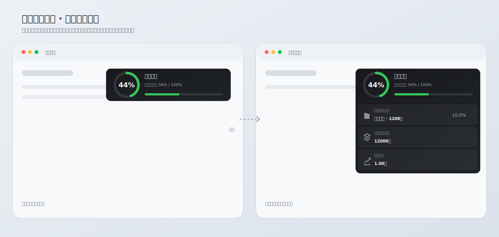

# Codex Token Monitor｜Codex 额度浮窗

[English](README.md) | [简体中文](README.zh-CN.md)

> [!IMPORTANT]
> 本项目公开源码，但不允许未经授权的商业使用。个人、研究、教育、公益等非商业用途适用 [PolyForm Noncommercial License 1.0.0](LICENSE)；商业使用必须事先取得版权所有者的书面许可。

> [!WARNING]
> 软件按现状提供，使用者自行承担安装、权限调整、数据偏差、服务中断及账号影响等风险。显示结果不是 OpenAI 官方账单或额度保证，详见[免责声明](DISCLAIMER.md)。

> 默认显示深色环形额度仪表；鼠标悬停后向下展开项目详情，移出自动收起。



`默认：环形剩余 60% ｜ 本周期已用 40% / 100% ｜ 进度条`<br>
`悬停后向下：当前项目（本周）／全部项目（本周）／历史总消耗`

支持 Apple 芯片和 Intel Mac，需要 macOS 13 或更高版本，并已安装和登录 Codex 桌面应用。

## 为什么做它

Codex 的额度信息需要进入相应入口查看，项目 Token 也缺少持续可见的上下文。这个小工具把额度百分比作为唯一常驻指标，其余信息只在鼠标悬停时显示。

## 功能

- 默认显示当前额度的环形剩余比例、已用比例和进度条。
- 显示当前项目本周消耗与所有项目本周消耗。
- 显示当前项目占本周 Token 的比例。
- 显示账户历史总消耗，统一换算为亿。
- 切换 Codex 中的任务或项目后，名称和该项目 Token 在 5 秒内更新。首次运行时，macOS 可能会请求辅助功能权限，用于读取 Codex 顶部当前显示的任务名称。
- 鼠标移入浮窗自动展开详情，移出自动收起，无需点击。
- 展开宽度基本不变，详情向下纵向显示，减少横向遮挡。
- 按住卡片任意位置拖动，顶部额度仪表在展开时保持固定。
- 默认缩小为原设计的 82%；展开后拖动右下角把手可在 65% 至 125% 范围内等比缩放。
- 拖到任一屏幕边缘后自动吸附成圆形额度状态球；将状态球拖回屏幕内部即可恢复完整卡片。
- 仪表使用固定深色表面，详情使用中性图标，只保留额度状态色。
- 使用真实透明圆角窗口与语义颜色，不留下矩形窗口底色。
- 位置与缩放比例自动保存。
- 仅在 Codex 位于前台时显示，主体点击穿透。

## 下载

从 [GitHub Releases](https://github.com/ArloYi/Codex-Token-Monitor/releases/latest) 下载最新版 Universal 2 ZIP 和校验文件，解压后即可打开，也可以把应用移动到“应用程序”目录。

应用采用本机临时签名，没有经过 Apple 公证。首次运行时，macOS 可能要求用户在“系统设置 > 隐私与安全性”中确认打开。

### 从源码构建

```bash
git clone https://github.com/ArloYi/Codex-Token-Monitor.git
cd Codex-Token-Monitor
zsh ./scripts/test.sh
open "build/Codex Quota HUD.app"
```

构建依赖：

- macOS 13 或更高版本
- Xcode Command Line Tools
- Codex 桌面应用
- Homebrew 和测试所需的 `ripgrep`
- 系统自带的 `sqlite3`、`codesign` 和 `zip`

安装测试依赖：

```bash
brew install ripgrep
```

### 生成发布包

```bash
zsh ./scripts/package-release.sh
```

Universal 2 压缩包及其 SHA-256 校验文件生成到 `dist/`，构建目录和发布包不会进入 Git。

## 如何使用

```text
默认：
[ 环形 XX% | 额度剩余 | 已用比例 | 进度条 ]
            按住任意位置拖动

鼠标悬停：
[ 环形 XX% | 额度仪表       ]
[ 当前项目（本周）           ]
[ 全部项目（本周）           ]
[ 历史总消耗            ◢    ]

拖到屏幕边缘：
( XX% )  ← 圆形额度状态球
```

1. 打开 Codex。
2. 启动 `Codex Quota HUD.app`。
3. 如果 macOS 请求辅助功能权限，请允许 **Codex 额度**。该权限只用于读取 Codex 顶部当前显示的任务名称。
4. 点击不同项目，最多等待 5 秒。
5. 鼠标移入浮窗，自动显示“当前项目本周消耗 / 所有项目本周消耗”、占比与历史总量。
6. 把浮窗拖到屏幕左、右、上或下边缘，松手后会收成状态球；拖离边缘恢复完整卡片。
7. 切换到微信、飞书、Chrome 等应用，浮窗立即隐藏。

## 数据口径

| 指标 | 含义 | 来源 |
|---|---|---|
| 额度剩余 | 当前额度窗口的剩余百分比 | 本机 Codex `app-server` |
| 项目本周消耗 | 当前 Codex 任务所属项目在额度窗口内的 Token | Codex 顶部任务名、`~/.codex` 状态与 SQLite |
| 本周总消耗 | 所有本地项目在额度窗口内的 Token | `~/.codex` SQLite 与 rollout |
| 占比 | 项目本周消耗 ÷ 本周总消耗 | 本地计算 |
| 总消耗 Token | 账户历史累计；远端为空时使用缓存或本地累计兜底 | Codex `app-server` 与本地状态 |

“本周”优先采用 Codex 返回的额度窗口；若不可用，则回退到最近 7 天。获得辅助功能权限后，项目识别只读取 Codex 顶部当前可见的任务名称，与本机任务元数据匹配，并把任务工作目录映射到所属项目。若信号或权限不可用，则依次回退到最近活跃任务、`selected-project` 和 `active-workspace-roots`。项目 Token 同时包含该项目子目录中的任务。

## 隐私

Codex Token Monitor 只读取计算并显示用量所需的本机 Codex 数据：

- `~/.codex/.codex-global-state.json`
- `~/.codex/state_5.sqlite`
- `~/.codex/session_index.jsonl`
- 本机 Codex 数据库引用的 rollout 文件
- 本机 Codex `app-server` 返回的额度和历史 Token 用量
- 用户授予辅助功能权限后，Codex 窗口顶部当前可见的任务名称

监视器自身不包含网络请求客户端，也不会上传项目路径、Codex 状态、rollout 内容或用量统计。它会在本机启动 Codex 提供的 `app-server`，并通过标准输入输出与其通信。Codex 自身产生的通信仍受 Codex 和 OpenAI 适用的条款与隐私规则约束。

应用只通过 macOS 用户默认设置保存浮窗位置、缩放比例、边缘吸附状态和最近一次可用的历史 Token 总量。它不会安装登录项、启动代理、通知服务、分析 SDK 或崩溃报告 SDK。

完整边界和安全报告方式请参阅[隐私说明](PRIVACY.md)、[安全说明](SECURITY.md)与[免责声明](DISCLAIMER.md)。

## 项目结构

```text
.
├── App/                    # macOS 应用元数据
├── Sources/                # Objective-C 原生实现
├── docs/                   # PRD 与界面资产
├── scripts/                # 构建、测试、隐私检查和发布打包
├── .github/                # CI、Issue 与 PR 模板
├── CONTRIBUTING.md
├── DISCLAIMER.md
├── PRIVACY.md
├── SECURITY.md
└── LICENSE
```

## 验证

```bash
zsh ./scripts/test.sh
```

测试覆盖 Token 格式、项目切换优先级、字体自适应、焦点安全规则、菜单栏移除、应用签名、包元数据和仓库隐私规则。

## 已知限制

- 支持 Apple 芯片和 Intel Mac，需要 macOS 13 或更高版本。
- 依赖 Codex 当前本地状态和 `app-server` 响应结构，Codex 升级后可能需要适配。
- 项目统计以本机可访问的 Codex 历史为准，不等同于官方计费账单。
- 当前没有自动更新、Apple 公证和登录时启动。

## 文档与贡献

- [产品需求文档](docs/PRD.md)
- [隐私说明](PRIVACY.md)
- [安全说明](SECURITY.md)
- [参与贡献](CONTRIBUTING.md)
- [免责声明与使用条款](DISCLAIMER.md)
- [版本记录](CHANGELOG.md)

## 许可与责任

本项目使用 [PolyForm Noncommercial License 1.0.0](LICENSE)。允许个人学习、研究、测试、教育、公益及许可证覆盖的其他非商业用途。未经版权所有者事先书面许可，不得进行商业使用、付费分发、与收费产品或服务捆绑，或为组织获取商业利益。

本软件不提供任何担保。使用、修改或分发本软件所产生的风险和后果由使用者自行承担。完整条款以 [LICENSE](LICENSE) 和[免责声明](DISCLAIMER.md)为准。

## 作者与项目声明

由 [Arlo Yi](https://github.com/ArloYi) 创建并维护。

Codex 与 OpenAI 是其各自权利人的商标或注册商标。本项目是独立社区项目，与 OpenAI 不存在隶属、认可、赞助或官方支持关系。
